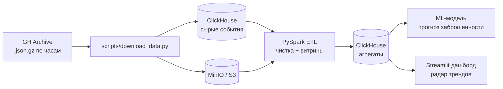

# IT-тренды по открытым логам GitHub (GH Archive)

Big Data проект: анализируем все публичные события GitHub (коммиты, звёзды, форки, PR) из [GH Archive](https://www.gharchive.org/) и строим «радар IT-трендов» — какие языки и библиотеки растут, какие репозитории набирают популярность, когда разработчики активнее всего.

## Архитектура



## Стек

| Слой | Технология |
|---|---|
| Хранилище сырых данных | MinIO (S3) + ClickHouse |
| Обработка | Apache Spark (PySpark) |
| ML | Python, scikit-learn / CatBoost |
| Визуализация | Streamlit |
| Инфраструктура | Docker Compose |

## Быстрый старт

Нужны: Docker Desktop и Python 3.10+.

Если нету:
```
Docker Desktop: https://www.docker.com/products/docker-desktop/
Python 3.10+: winget install --id Python.Python.3.12 -e
```
Если установлено:
```bash
# 1. Склонировать репозиторий
git clone https://github.com/AnGeJloV/gh-trends.git
cd gh-trends

# 2. Поднять инфраструктуру (ClickHouse + MinIO + авто-создание бакета raw)
docker compose up -d
# Первый запуск качает образы ~1 ГБ, дальше — секунды

# 3. Скачать данные (каждый качает себе локально)
pip install -r requirements.txt

на выбор:
python scripts/download_data.py # 3 дневных часа с 2026-09-20 (~50 МБ) по умолчанию
python scripts/download_data.py --hours 24 --hour 0   # сутки
python scripts/download_data.py --from 2026-09-01 --to 2026-09-15   # произвольный период (полный период проекта — с 2026-09-01)

# 4. Загрузить данные в MinIO (бакет raw) и ClickHouse (gh.events_raw)
python scripts/load_raw.py
# Повторный запуск пропускает уже загруженные файлы — можно докачивать и догружать.
```

Проверить, что ClickHouse поднялся: открыть <http://localhost:8123> — должно быть `Ok.`
Веб-клиент для SQL-запросов: <http://localhost:8123/play> логин `default`, пароль `clickhouse` (см. `docker-compose.yml`).

Запросы для проверки ClickHouse:

- `SHOW TABLES FROM gh;`
- `SELECT count() FROM gh.events_raw;`

Консоль MinIO: <http://localhost:9001> (логин/пароль `minioadmin`/`minioadmin`, иначе — см. `docker-compose.yml`).

## Команда и зоны ответственности

| Кто | Роль | Папка | За что отвечает |
|---|---|---|---|
| Человек 1 | Data Engineer / DevOps | корень + `scripts/` | docker-compose, скачивание, загрузка данных в MinIO и ClickHouse |
| Человек 2 | Spark-разработчик | `etl/` | парсинг JSON, чистка, агрегаты (витрины) |
| Человек 3 | Data Scientist | `ml/` | модель прогноза заброшенности репо, метрики |
| Человек 4 | BI / презентатор | `dashboard/` | Streamlit-дашборд, записка, презентация |

## Как работать в репозитории

1. Каждый работает **только в своей папке** (см. таблицу выше) — так вы не помешаете друг другу.
2. Работаем без ревью: пушим прямо в `main`, у всех равный доступ. Перед пушем всегда сначала `git pull`. После завершения работы сразу `git push` — не держим локальные изменения дольше дня.
3. Данные (`data/`, `*.json.gz`) в git **не коммитим** — качаем скриптом.
4. Задачи и план — в [docs/TASKS.md](docs/TASKS.md). Сделал задачу — поставь `[x]` и допиши строку в журнал.
5. Запустить ETL и расчет витрин (Человек 2 — Spark)
``` docker compose up --build spark-etl ```
(Spark прочитает данные из MinIO, проведет очистку, рассчитает 3 витрины и сохранит их в ClickHouse).
